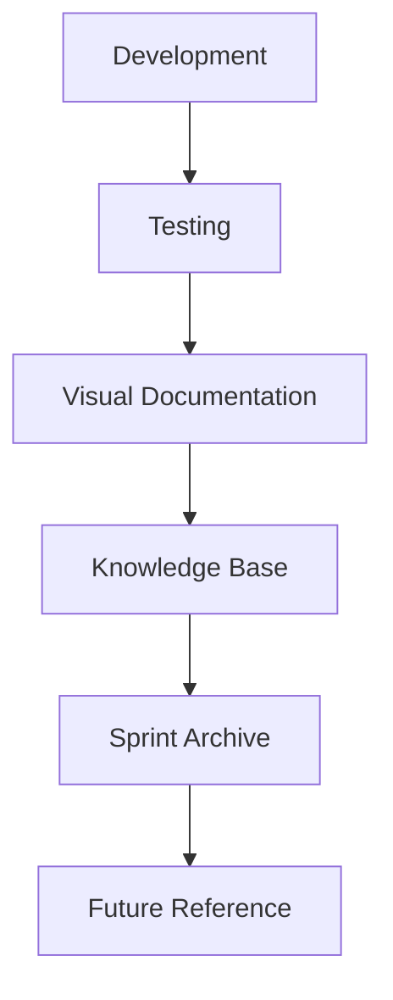

# 🛠️ Homy Sprint Tools Architecture

## 🎯 Overview

The Homy UI v3 sprint system is built on three core principles:

- 📸 Visual Documentation
- 🧪 Comprehensive Testing
- 🔄 Continuous Integration

## 🧩 System Components

### 🧪 Test Infrastructure

```bash
# Core Testing
yarn test              # Run all tests
yarn test:watch       # Development mode with watch
yarn test:coverage    # Generate coverage reports
yarn test:ci          # CI/CD pipeline tests

# Accessibility Testing
yarn test:a11y        # WCAG compliance tests
yarn storybook:a11y   # UI component accessibility
```

#### 🎯 Testing Philosophy

- Unit tests are integrated with visual snapshots
- Accessibility is a first-class citizen
- Every component has a story, every story has a test

### 📸 Visual Documentation System

```bash
# Screenshot Management
yarn screenshot        # Capture specific UI state
yarn screenshot:all   # Full UI documentation
yarn tag:screenshots  # AI-powered image tagging

# Knowledge Integration
yarn export:notion    # Export to Notion workspace
yarn process:screenshot # Cleanup and organization
```

#### 🎨 Visual Documentation Flow

1. Capture UI states with CleanShot
2. Auto-organize with cleanshot-auto-sort.sh
3. Tag and categorize with AI
4. Export to knowledge base
5. Reference in sprint documentation

### 🚀 Sprint Operations

```bash
# Sprint Lifecycle
yarn sprint:init      # Initialize new sprint
yarn build           # Production build
yarn generate-assets # Sprint deliverables
yarn record         # Sprint demo recordings
yarn demo           # Stakeholder presentations
```

#### 📊 Sprint Management

- Every sprint has its visual history
- Automated documentation generation
- Integrated demo system
- Stakeholder-ready outputs

## 🔄 Integration Points

### 📚 Documentation Flow



### 🤝 Stakeholder Interaction

- Visual progress tracking
- Accessible documentation
- Demo-ready environments
- Integration with business tools

## 🎯 Usage Guidelines

### 📸 Visual Documentation

1. Use CleanShot for all UI captures
2. Follow naming conventions
3. Include context in screenshots
4. Tag for searchability

### 🧪 Testing

1. Write tests alongside components
2. Include visual regression tests
3. Verify accessibility
4. Document edge cases

### 🚀 Sprint Management

1. Initialize with proper structure
2. Document decisions
3. Capture visual progress
4. Prepare stakeholder materials

## 🔧 Maintenance

### 📋 Regular Tasks

- Update screenshot templates
- Verify test coverage
- Clean sprint archives
- Update documentation

### 🔄 Automation Scripts

- cleanshot-auto-sort.sh
- init-sprint-docs.sh
- sprint-init.ts

## 📈 Future Roadmap

### 🎯 Planned Enhancements

- AI-powered documentation generation
- Automated visual regression testing
- Enhanced knowledge base integration
- Real-time collaboration tools

## 🏆 Best Practices

### 📸 Visual Documentation

- Capture full context
- Include error states
- Document responsive behavior
- Tag for searchability

### 🧪 Testing

- Write meaningful assertions
- Include edge cases
- Document test scenarios
- Maintain visual references

### 🚀 Sprint Management

- Initialize properly
- Document decisions
- Track visual progress
- Prepare for handoff

---

> "Code is not just written. It is tested.
> It is documented. It is visualized.
> It bears witness to our craft."

Generated with 💝 by Homy UI Team
