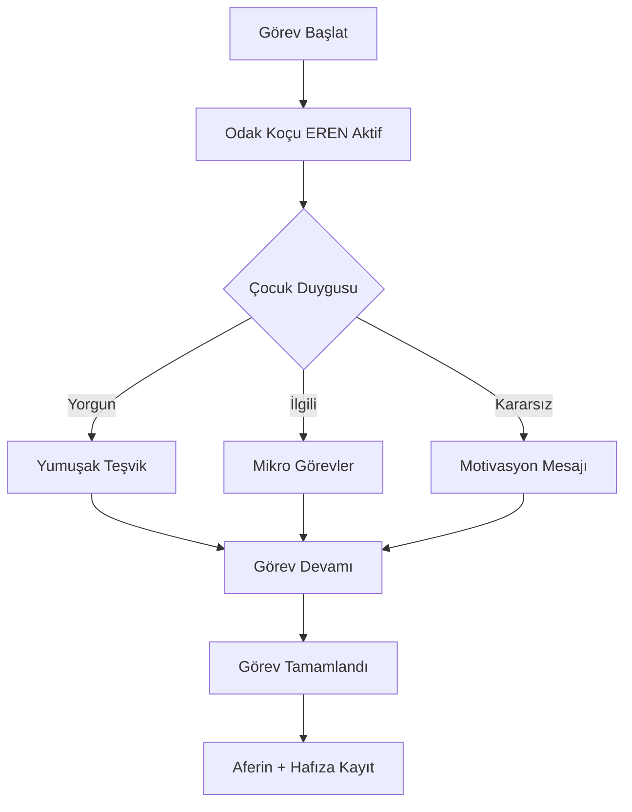

# EREN Modülü – NeuroFocus Coach

## 🧩 Modül Adı

FocusCoachCard – EREN Modu

## 🧠 Amaç

Dikkat dağınıklığı, öğrenme güçlüğü, erteleme eğilimi yaşayan çocuklar için dijital, empatik bir destekçi sunmak. Özellikle disleksi gibi özel öğrenme gereksinimleri olan çocukları hedef alır.

## 🎯 Hedef Kullanıcı

- 8–16 yaş arası dikkat sorunu yaşayan çocuklar
- Disleksi/DEHB gibi öğrenme bozuklukları olan öğrenciler
- Dijital ortamda destek arayan veliler ve eğitim koçları

## 🧠 Ana Yetkinlikler

| Özellik                      | Açıklama                                                                                  |
| ---------------------------- | ----------------------------------------------------------------------------------------- |
| 🎙️ Empatik Dil               | Çocukların duygusal ihtiyaçlarına göre yönlendirme yapar (örn. yorgun, bıkkın, kararsız). |
| 🧩 Mikro Görevleme           | Büyük görevleri küçük adımlara böler (MicroTaskEngine).                                   |
| 🌟 Duygusal Destek Mesajları | Türkçe, anlaşılır ve sıcak tonlu mesajlar içerir.                                         |
| 🧠 NeuroFocusEngine          | Çocuğun duygusal tepkilerini öğrenir ve buna göre öneriler sunar.                         |
| 🧾 Hafıza Takibi (memory)    | Yapılan görevleri, duygusal yanıtları ve başarıları kaydeder.                             |
| 📸 CleanShot + Snapshot      | Görsel testler ve belgelerle UI doğruluğu sağlanır.                                       |
| ✅ A11y (Erişilebilirlik)    | Tüm UI bileşenleri WCAG uyumlu, ekran okuyucularla dost.                                  |

## 🔁 Akış



## 🧪 Testler

- Snapshot test (focus-coach/eren-mode.png)
- Jest accessibility test
- Mikro görev etkileşimi
- Duygu butonu ile destek mesajı gösterimi

## 📸 Screenshot


## 🧠 Örnek Mesajlar

```typescript
const EmotionalSupportMessages = {
  tired: 'Dinlenmek de başarıya giden yolun bir parçasıdır.',
  frustrated: 'Zorlanman normal, birlikte kolaylaştırabiliriz.',
  curious: 'Harika! Merak en güçlü pusulandır.',
  determined: 'Bu sefer olacak, çünkü deniyorsun!',
  proud: 'Kendinle gurur duyabilirsin, ben senin yanındayım.',
};
```

## 🧩 Entegrasyonlar

- `NeuroFocusEngine.ts`
- `mergeStrategy.ts`
- `FocusCoachCard.tsx`
- `memory/screenshot-log.json`
- `docs/screenshots/focus-coach/eren-mode.png`

## 📚 Referanslar

- [WCAG 2.1 Erişilebilirlik Standartları](https://www.w3.org/WAI/standards-guidelines/wcag/)
- [Next.js 15.3.1 Dokümantasyonu](https://nextjs.org/docs)
- [Jest Test Framework](https://jestjs.io/docs/getting-started)
