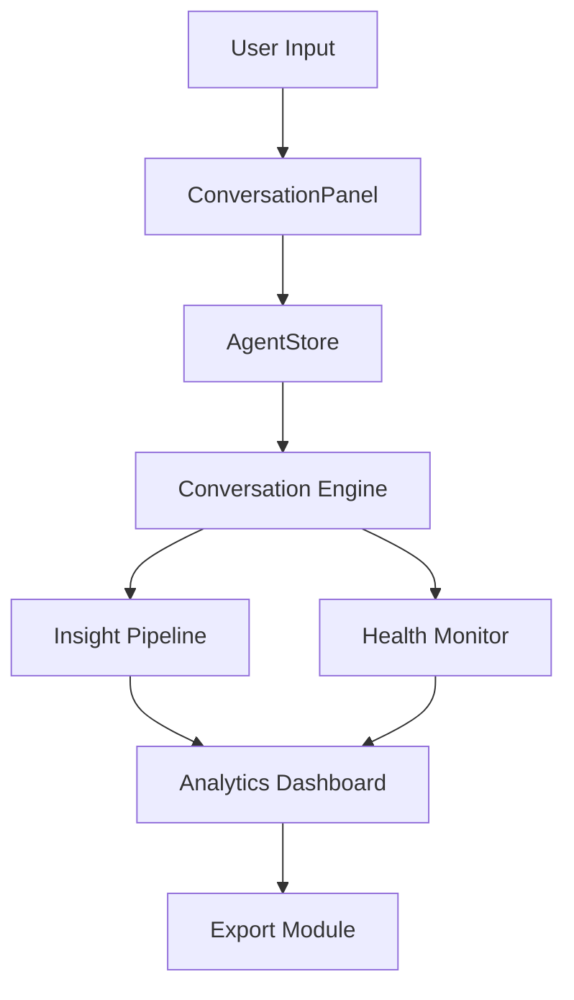

# Conversations Health - Technical Architecture

## System Overview

The Conversations Health feature is built on a layered architecture that enables real-time communication between users and AI agents while maintaining conversation context and generating insights.

## Core Components

### 1. Conversation Engine

```typescript
interface ConversationEngine {
  startConversation(topic: string): void;
  sendMessage(content: string): Promise<void>;
  endConversation(): void;
  getContext(): ConversationContext;
}

interface ConversationContext {
  topic: string;
  startTime: string;
  messageCount: number;
  participants: {
    user: string;
    agent: string;
  };
  metadata: Record<string, unknown>;
}
```

### 2. Health Monitoring

```typescript
interface HealthMetrics {
  responseTime: number;
  completionRate: number;
  userSatisfaction: number;
  contextRetention: number;
  errorRate: number;
}

interface HealthMonitor {
  trackMetric(metric: keyof HealthMetrics, value: number): void;
  getHealthReport(): HealthReport;
  setThresholds(thresholds: Partial<HealthMetrics>): void;
}
```

### 3. Insight Pipeline

```typescript
interface InsightPipeline {
  analyze(conversation: Conversation): Promise<ConversationInsights>;
  extractPatterns(): Pattern[];
  generateRecommendations(): Recommendation[];
}

interface ConversationInsights {
  patterns: Pattern[];
  sentiment: SentimentAnalysis;
  topics: Topic[];
  actions: RecommendedAction[];
}
```

## Data Flow



## State Management

### AgentStore Extensions

```typescript
interface ConversationState {
  activeConversations: Map<string, Conversation>;
  history: ConversationHistory;
  insights: ConversationInsights;
  health: HealthMetrics;
}

interface ConversationActions {
  startConversation: (topic: string) => void;
  sendMessage: (content: string) => Promise<void>;
  endConversation: () => void;
  exportConversation: (format: 'json' | 'md') => string;
}
```

## UI Components

### ConversationHistory

```typescript
interface ConversationHistoryProps {
  conversations: Conversation[];
  onSelect: (id: string) => void;
  onExport: (id: string, format: ExportFormat) => void;
  filter?: ConversationFilter;
}

interface ConversationFilter {
  dateRange?: DateRange;
  status?: ConversationStatus;
  topic?: string;
  sentiment?: SentimentType;
}
```

### HealthDashboard

```typescript
interface HealthDashboardProps {
  metrics: HealthMetrics;
  thresholds: Partial<HealthMetrics>;
  timeRange: TimeRange;
  onThresholdChange: (metric: keyof HealthMetrics, value: number) => void;
}
```

## Export Formats

### JSON Structure

```json
{
  "conversation": {
    "id": "conv-123",
    "topic": "Lab Results Analysis",
    "startTime": "2024-03-20T10:00:00Z",
    "endTime": "2024-03-20T10:15:00Z",
    "messages": [
      {
        "id": "msg-1",
        "sender": "user",
        "content": "Can you analyze these results?",
        "timestamp": "2024-03-20T10:00:00Z"
      }
    ],
    "insights": {
      "sentiment": "positive",
      "topics": ["lab-results", "analysis"],
      "actions": ["review", "recommend"]
    }
  }
}
```

### Markdown Template

```markdown
# Conversation: Lab Results Analysis

Date: March 20, 2024
Duration: 15 minutes

## Messages

10:00 User: Can you analyze these results?
10:01 Agent: I'll help you analyze the results...

## Insights

- Sentiment: Positive
- Topics: lab-results, analysis
- Actions: review, recommend

## Health Metrics

- Response Time: 1.2s
- Completion Rate: 100%
- Context Retention: 95%
```

## Implementation Phases

1. **Foundation (Week 1)**

   - Base conversation components
   - Store integration
   - Basic health monitoring

2. **Enhancement (Week 2)**

   - Insight pipeline
   - Export functionality
   - Advanced health metrics

3. **Polish (Week 3)**
   - UI refinements
   - Performance optimization
   - Documentation

## Security Considerations

- Message encryption at rest
- User data anonymization
- Rate limiting
- Access control
- Audit logging

## Performance Goals

- Message round-trip time: < 1s
- UI render time: < 100ms
- Export generation: < 2s
- Insight generation: < 5s
- History load time: < 500ms

## Monitoring & Alerts

- Response time thresholds
- Error rate monitoring
- Health score alerts
- Usage analytics
- Performance metrics

## Future Considerations

- Multi-agent conversations
- Voice interface
- Real-time translation
- Advanced analytics
- ML-powered insights
