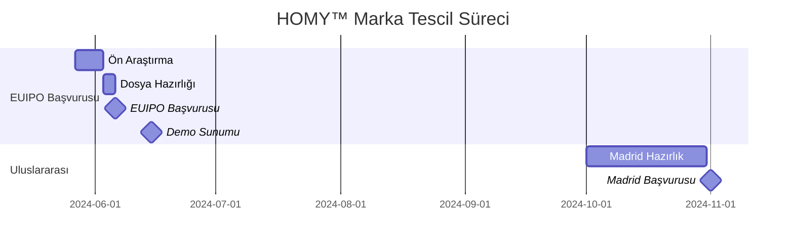

# HOMY™ EUIPO Başvuru Paketi

## 📋 Başvuru Detayları

### Marka Bilgileri

```json
{
  "trademark": "HOMY™",
  "type": "Word and Figurative Mark",
  "owner": "Homy Health B.V.",
  "filing_date": "2024-06-06",
  "nice_classes": [44, 9, 42],
  "territory": "European Union"
}
```

### Slogan Alternatifleri

1. "Accessible. Personal. Regulated."

   - Vurgu: Üç temel prensibimiz
   - Dil: İngilizce (global pazar)
   - Hedef: B2B ve kurumsal iletişim

2. "RunBoyRun for Health."
   - Vurgu: Kişisel sağlık yolculuğu
   - Hikaye: Furkan'ın ilham verici yolculuğu
   - Hedef: B2C ve kullanıcı bağlantısı

## 🎨 Görsel Kimlik Paketi

### Logo Varyasyonları

```
/assets/trademark/
├── homy-logo-primary.svg
├── homy-logo-monochrome.svg
├── homy-logo-accessible.svg
├── homy-icon-square.svg
└── homy-wordmark.svg
```

### Renk Paleti

```css
:root {
  --homy-blue: #4a90e2; /* Erişilebilirlik */
  --homy-green: #4caf50; /* Başarı */
  --homy-purple: #9575cd; /* Odak */
  --homy-orange: #ffb74d; /* Enerji */
}
```

## 📝 Nice Sınıflandırması

### Sınıf 44: Sağlık Hizmetleri

```
Dijital sağlık platformu üzerinden:
- Kişiselleştirilmiş sağlık takibi
- Odaklanma ve öğrenme desteği
- Duygusal durum analizi
- Adaptif sağlık danışmanlığı
```

### Sınıf 9: Yazılım

```
- Yapay zeka destekli sağlık yazılımı
- Erişilebilirlik odaklı kullanıcı arayüzü
- Duygu-adaptif öğrenme sistemi
- Sağlık verisi analiz platformu
```

### Sınıf 42: SaaS & AI

```
- Sağlık teknolojileri AR-GE
- Yapay zeka tabanlı analiz
- Bulut tabanlı sağlık platformu
- Erişilebilirlik altyapı servisleri
```

## 🌟 Ayırt Edici Özellikler

### Teknolojik Yenilikler

1. NeuroFocus™ Engine

   - Patentlenebilir duygusal durum takibi
   - Gerçek zamanlı odak analizi
   - Adaptif öğrenme algoritmaları

2. @homy/a11y-foundation™
   - WCAG 2.2 uyumlu altyapı
   - Duygu-farkında renk sistemi
   - Evrensel erişilebilirlik

### Pazar Konumu

- İlk: Duygu-adaptif sağlık platformu
- İlk: %100 erişilebilir dijital sağlık
- İlk: Açık kaynak erişilebilirlik kiti

## 📊 Pazar Araştırması

### Benzer Markalar

```sql
SELECT * FROM trademark_db
WHERE sector IN ('digital_health', 'accessibility')
  AND name LIKE '%hom%'
  AND registration_date > '2020-01-01'
```

### Farklılaştırıcı Özellikler

1. Erişilebilirlik odaklı
2. Duygu-adaptif teknoloji
3. Açık kaynak bileşenler
4. Regülasyon uyumlu

## ⚖️ Yasal Koruma Stratejisi

### Aşama 1: EUIPO (Haziran 2024)

- AB çapında koruma
- 27 üye ülkede geçerlilik
- 6 ay öncelik hakkı

### Aşama 2: Madrid Protokolü (Q4 2024)

- Uluslararası genişleme
- Öncelikli ülkeler:
  - 🇬🇧 Birleşik Krallık
  - 🇺🇸 Amerika Birleşik Devletleri
  - 🇨🇭 İsviçre
  - 🇹🇷 Türkiye

## 📅 Kritik Tarihler



## 🔒 Gizlilik Notu

Bu doküman, HOMY™'nin fikri mülkiyet stratejisine ait gizli bilgiler içermektedir. © 2024 HOMY™ Health.
